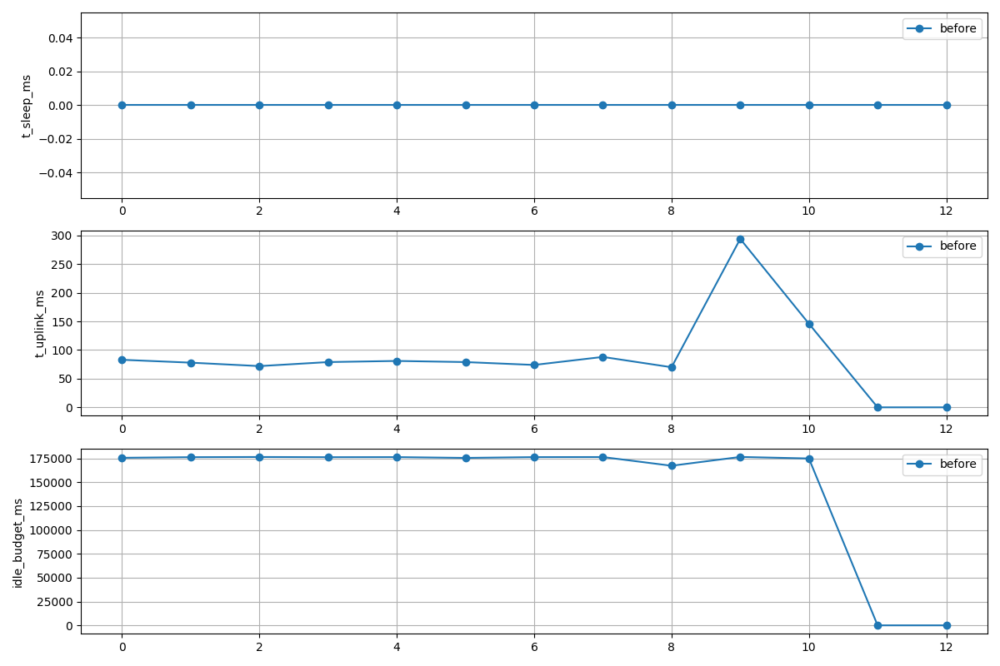

# Power Comparison Report

Generated: 2025-11-30T13:07:01.351770 UTC

## Summary metrics

| Metric | Before | After | Delta |
|---:|---:|---:|---:|
| samples | 13 | 0 | -13 |
| idle_avg_ms | 148269.46 | 0 | -148269.46 |
| sleep_avg_ms | 0.00 | 0 | 0.00 |
| uplink_avg_ms | 88.00 | 0 | -88.00 |
| uplink_bytes_avg | 715.00 | 0 | -715.00 |
| est_energy_J | 1929.22 | 0.00 | -1929.22 |

## Plots



## Details

Before metadata:
```json
{
  "energy_estimate_j": 1929.2189999999998,
  "detail": "Est energy: 1929.22 J (sleep=0.00 J uplink=1.72 J idle=1927.50 J)"
}
```
After metadata:
```json
{}
```